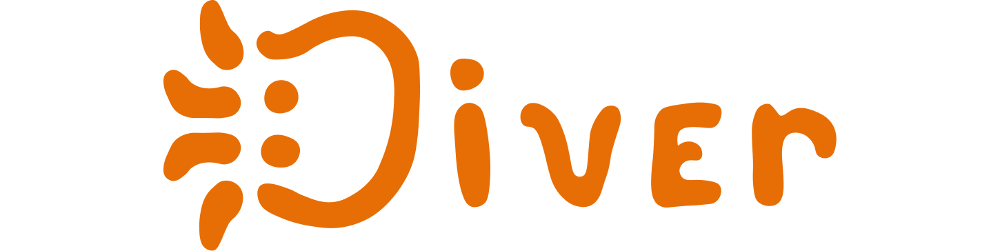
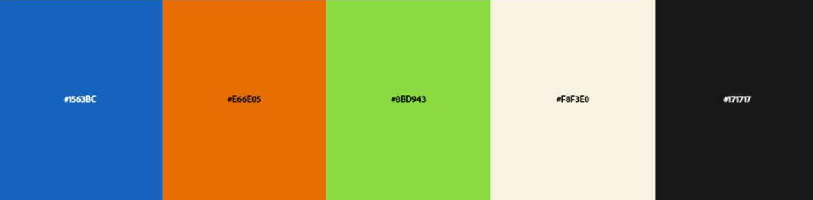
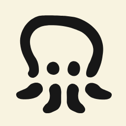

# Diver

A diver é uma marca que celebra a diversidade e a inclusão.
Criada por uma equipe formada por pessoas de diferentes origens e perspectivas, a Diver nasceu para representar e valorizar essa pluraridade.

Nosso nome vem de "**Diver**sidade", e o nosso mascote é um polvo - um símbolo de adaptação e flexibilidade, capaz de se moldar a diferentes ambientes, assim como nós nos moldamos para atender às necessidades de cada projeto.

Com uma identidade visual leve e divertida, a Diver se posiciona como uma marca acessível e criativa, comprometida em oferecer soluções inovadoras e acolhedoras para todes.

## Nossos Membros

| Nome              | Cargo            |
| :---------------- | :--------------- |
| Shyanne Soares    | Lider de Projeto |
| Pedro Henrique    | Designer         |
| Yves Klavdian     | Designer         |
| Kodie Freitas     | Dev Frontend     |
| Maria Eduarda     | Dev Fullstack    |
| Antonio Guilherme | Dev              |
| Paulo Magalhães   | Dev Backend      |

## Nossa Marca

As cores da marca:

| cor           | código  |
| :------------ | :------ |
| Primária 1    | #1263BC |
| Primária 2    | #E66E05 |
| Secondária    | #8BD943 |
| Neutra Clara  | #F8F3E0 |
| Neutra Escura | #171717 |

Nosso mascote/avatar:

